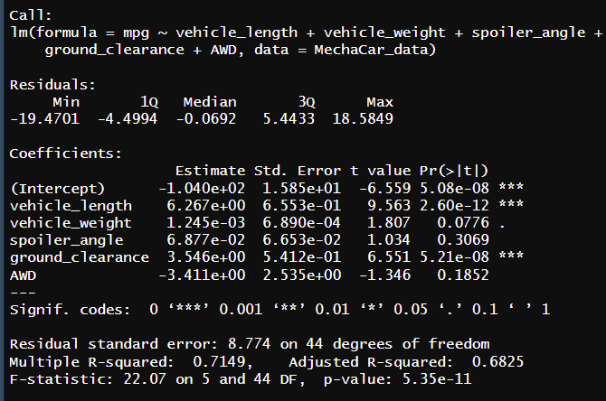
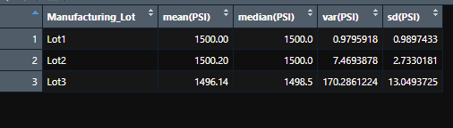
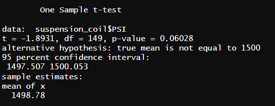
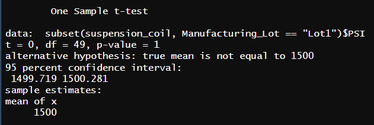
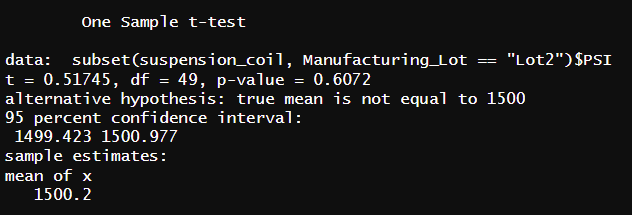
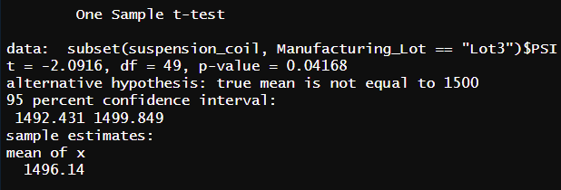

# MechaCar_Statistical_Analysis

## Linear Regression to Predict MPG

- Which variables provided a non random amouunt of variance to the MPG values?
The two variables that show this are vehicle length (p-value 2.60e-12) and  
ground clearance (p-value 5.21e-08).  Both of those p-values are below our
signifcance level of .05.  

- Is the slope of the linear model considered to be zero? Why or why not?
  the slope of this model is not considered to be zero because our overall
  p-value is 5.35e-11 which again is below our significance level of .05. 
  Because of this we can reject our null hypothesis and state that it's not
  true.5

- Does this linear model predict mpg of MechaCar prototypes effectively? Why or why not?
OUr R Squared value for our analysis is .7149.  We can make that into a percentage 
of 71.5% which  means our predictive model is saying that 71.5% of the time we
are being accurate, making this model effective in this prediction.   

## Summary Statistics on Suspension Coils

The design specifications for the MechaCar suspension coils dictate that the variance of the 
suspension coils must not exceed 100 pounds per square inch. Does the current manufacturing 
data meet this design specification for all manufacturing lots in total and each
lot individually? Why or why not?

### Total Summary for all Suspension Coils

### Summary of our three lots

- Above we have two images, is is our total summary for our PSI and the other is our
  total summary of our three lots. The question that is asked is the current PSI 
  on our coils designed to our specification of not exceeding 100 lbs per square
  inch.  When we look at the total summary we see our variance  for PSI is 62.29
  which is under the required 100 PSI.  Ovarall that is in good shape
  
 -Our next review then is our indiviual lots and the first two lots are under our
 PSI requirement.  They are both very low actaully at .97 and 7.46 but our third
 lot is well over the 100 PSI criteria at 170.28.  That is a significnt jump and
 we'll need to review this again to see why the three lots have such a huge gap
 in variance. 

## T-Tests on Suspension Coils

### T-Tests for all Lots

- This is our first t.test that summarizes all our lots.  In this we can see that
our p-value is .06 which is above the significance level of .05.  This means we do
not have enough evidence to reject the null hypothesis.  

- Now we break down the indiviual lots and this is our Lot 1.  Our p-value here is
1.0, which is above our .05 signicance level.  Again we have no evidence to reject
our null hypothesis

- This image if of Lot 2 which shows our p-value at .60 which is again above .05 for
our significance level.  This lot again shows no evidence to reject our hypothesis.

- Lot 3 though is different with a p-value of .04 which is below our significant level
of .05.  This would mean for lot 3 we can reject our hypothesis because there is a
statistical difference.

## Study Design: MechaCar vs Competition

The way gas prices have been fluctuating over the past few years it would be a good
item to compare MechaCar verses their competitors in fuel effiency.  So we could do 
an analysis on MPG verses their competors. We could use the MPG and if a car has 
AWD since that is a very popular option these days.  If we can show the MechaCar
is more fuel efficeint as a vehicle with AWD this may push some customers toward
purchasing a vehicle that can handle all sorts of terrain.  Our null hypotheis then
could be MechaCar MPG in AWD vehicles is more fuel efficent than our competitors.  
The alternate Hypothesis would be there is no difference between our MechaCar's
fuel efficiency verses our competitors.  We could then use a two-sample t.test
comparing vehicles under relatively the same conditions ( same gas, same paths 
taken with same amount of acceleration) to compare two samples.

